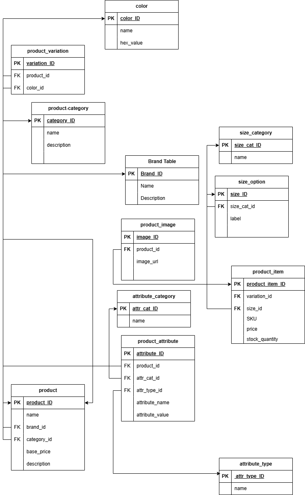

# 🛒 E-Commerce Database Project

Welcome to our E-Commerce Database Design project! This project showcases the design and implementation of a relational database system tailored for a scalable and flexible online store platform. From conceptual modeling to SQL schema creation, we collaboratively built a database that handles complex product variations, attributes, and categorization — just like you'd expect from a modern e-commerce platform.

---

## 📌 Project Overview

This database was designed to support a wide range of product types, sizes, colors, and attributes. It allows an online store to manage inventory at a granular level — from product variations (like color or size) to dynamic product attributes (like weight, material, or brand).

---

## 📐 Entity-Relationship Diagram (ERD)

The ERD clearly defines entities, attributes, and relationships used in our e-commerce system.  

---

## 🗃️ Database Tables

Below are the tables included in our schema:

- `brand` – Stores product brand info  
- `product_category` – Categories like clothing, electronics  
- `product` – General product details  
- `product_image` – URLs or references to product images  
- `color` – Available color options  
- `size_category` – Categories of sizes (e.g., clothing, shoes)  
- `size_option` – Specific size values (e.g., S, M, L, 42)  
- `product_variation` – Combines a product with a color  
- `product_item` – A sellable item with a specific size and variation  
- `attribute_category` – Groups of attributes (e.g., physical, technical)  
- `attribute_type` – Data types for attributes (e.g., text, number, boolean)  
- `product_attribute` – Custom attributes like material, weight, etc.

---

## 📂 Files in This Repository

| File Name       | Description                                    |
|-----------------|------------------------------------------------|
| `ecommerce.sql` | SQL script to create and set up the database   |
| `ERD.png`       | Image of the entity-relationship diagram       |
| `README.md`     | It's the documentation of the project                            |

---

## 🔄 Data Flow Overview

- Products belong to categories and brands  
- Each product has variations (e.g., color) and specific items (e.g., size)  
- Images, attributes, and stock levels are attached to individual product items  
- Attributes are grouped and typed for consistency and flexibility

---

## 👥 Contributors

This project was brought to life through teamwork and collaboration:

- 🧠 **Jeff Mbita** – Designed the ERD and data architecture  
- 🛠️ **Elidy Muriithi** – Created the SQL tables and schema  
- 📝 **Margaret Nungari** – Authored the README and documentation

---

## 🚀 How to Use

1. Clone this repository  
2. Open your preferred SQL environment (e.g., MySQL Workbench)  
3. Run the `ecommerce.sql` file to create all tables  
4. (Optional) Use the ERD for visual reference

---

## 📬 Contact

For questions, collaboration, or feedback, feel free to reach out via GitHub or connect with any of the contributors!

---

